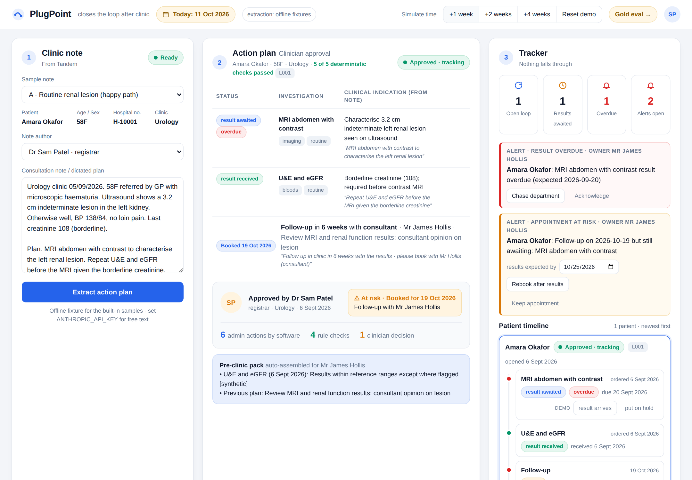
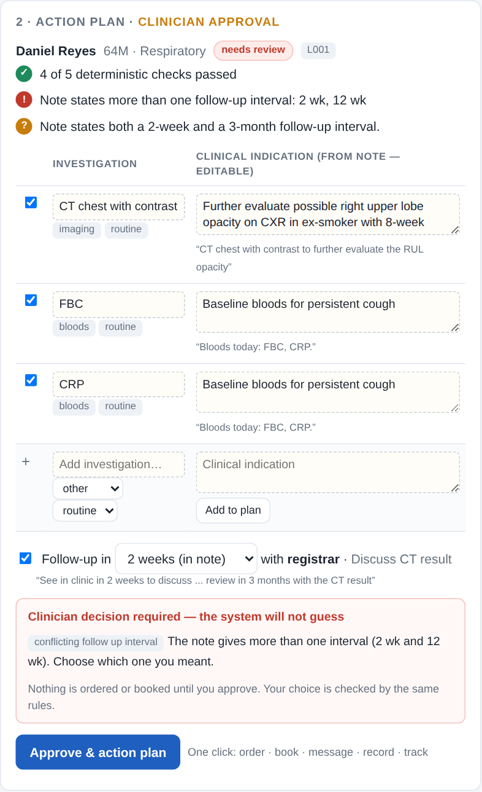
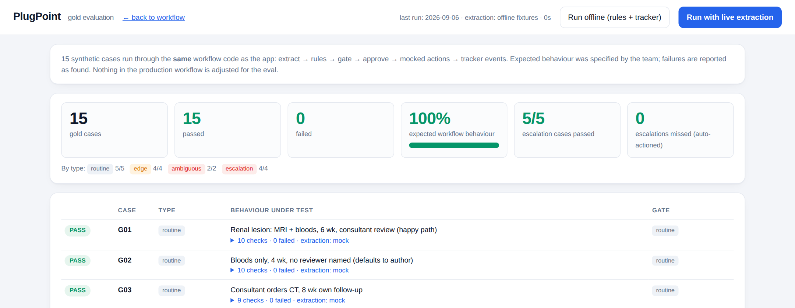

<div align="center">

# PlugPoint

**Closes the loop after outpatient clinic — so no patient is lost to follow-up.**

Turns a clinician's dictated plan into a tracked, approved action plan: investigations ordered, follow-up booked with the right clinician, the patient told, and every open item watched until the results are reviewed.

[](https://github.com/nickjlamb/tandem-hackathon-2026/actions/workflows/eval.yml)
[](https://www.python.org/)
[](https://fastapi.tiangolo.com/)
[](LICENSE)
[](#about)
[](#safety-and-data)

[Quick start](#quick-start-60-seconds) · [How it works](#how-it-works) · [Architecture](#architecture) · [Examples](#examples) · [Evaluation](#evaluation) · [Roadmap](#roadmap) · [Contributing](CONTRIBUTING.md) · [Changelog](CHANGELOG.md)



</div>

---

## The problem

After an outpatient consultation the clinician has a plan in their head: *order a scan, repeat bloods, see the patient again in six weeks with the results.* Turning that into reality is a chain of admin — separate requests, emails to secretaries, and someone remembering to check that results came back before the appointment. When clinics are busy, steps get missed. A scan is never booked, a result sits unread, a patient is seen before their results exist. **Patients are lost to follow-up.**

## What PlugPoint does

| Step | Who | What |
|------|-----|------|
| **Extract** | AI (one schema-constrained call) | Reads the clinic note and records the plan the clinician already made: investigations + indications, follow-up interval, who should review. Never adds or infers. |
| **Check** | Deterministic rules | Every investigation has an indication · one unambiguous follow-up interval · appointment falls after results are expected · reviewer resolved. |
| **Approve** | Clinician | One click. The plan is editable; nothing is ordered or booked before approval. Ambiguous plans stop here — **the system never guesses**. |
| **Act** | Integrations (mocked) | Orders sent, follow-up booked with the right clinician, patient messaged, EPR updated. |
| **Track** | Deterministic | Every item has an expected-by date. Overdue results, appointments at risk and investigations put on hold raise an alert to a **named owner** with chase / rebook / hold-resolved actions. |
| **Audit** | — | Every event labelled `AI` · `RULE` · `HUMAN` · `API` · `SYSTEM`. |

> **Design principle:** automate the admin, keep clinical judgement visible. Routine cases flow; exceptions go to humans. Don't just generate text — complete work. Don't just demonstrate it — test it.

## Quick start (60 seconds)

```bash
git clone https://github.com/nickjlamb/tandem-hackathon-2026.git && cd tandem-hackathon-2026
./run.sh                 # creates .venv, installs 5 packages, serves the app
```

Open **http://localhost:8000**. That's it — the four built-in sample notes run end to end with **no API key and no network**, using offline extraction fixtures that mirror the live model output.

To extract free-text notes with Claude:

```bash
cp .env.example .env     # add ANTHROPIC_API_KEY=...
./run.sh                 # header badge switches to "extraction: claude"
```

Requirements: Python 3.11+. Tested on macOS and Linux.

## How it works

```mermaid
flowchart LR
    N[Clinic note<br/><i>Tandem / dictation</i>] --> AI
    subgraph AI[AI · one structured call]
        X[Extract ActionPlan<br/>investigations · indications<br/>follow-up · reviewer]
    end
    AI --> R
    subgraph R[RULE · deterministic]
        C1[indication stated]
        C2[single interval]
        C3[appointment after results]
        C4[reviewer resolved]
    end
    R -->|routine| H[HUMAN · approve<br/>edit · add · drop items]
    R -->|blocked| D[HUMAN · decide<br/>choose interval · add indication]
    D --> H
    H --> A
    subgraph A[API · mocked integrations]
        O[Order comms]
        P[PAS booking]
        S[Patient SMS]
        E[EPR record]
    end
    A --> T
    subgraph T[SYSTEM · tracker]
        T1[expected-by dates]
        T2[overdue · at risk · on hold]
        T3[alerts to named owner]
    end
    T -->|chase · rebook · resolve hold · close| H2[HUMAN]
    H2 --> Z[(Loop closed<br/>results reviewed)]
    classDef ai fill:#efe9fb,stroke:#6b4fbb,color:#2b1d5c
    classDef rule fill:#e6f5ee,stroke:#1f8a5b,color:#0f4a30
    classDef human fill:#fff3e0,stroke:#c77d0a,color:#5c3a00
    classDef api fill:#e8f0fc,stroke:#1f5fbf,color:#0e2f66
    classDef sys fill:#eef2f7,stroke:#66717f,color:#1c2430
    class X ai; class C1,C2,C3,C4 rule; class H,D,H2 human; class O,P,S,E api; class T1,T2,T3 sys
```



**Workflow, not agent.** There is exactly one LLM call, and it does the only thing an LLM is needed for — turning messy language into structured data. Everything after that is `if` statements, dates and state transitions, so the same input always gives the same behaviour and the behaviour can be tested.

### Loop and item states

```
Loop:  awaiting_approval ─► open ─► closed        (needs_review when a rule blocks)
Item:  proposed ─► result_awaited ─► result_received ─► reviewed
                        │
                        ├─ overdue   (today > expected_by)          → alert: chase
                        └─ on_hold   (department vetting query)     → alert: resolve hold
Appointment:  booked ─► at_risk (results not expected in time)      → alert: rebook / keep
```

## Architecture

```
plugpoint/
├── schema.py        Pydantic contracts: ActionPlan, Investigation, FollowUp, GateResult …
├── extract.py       the ONE LLM call (forced tool use → ActionPlan); offline fixtures fallback   [AI]
├── rules.py         5 plan checks, turnaround table, reviewer rule, earliest-date maths         [RULE]
├── tracker.py       Store: loops, items, approval, events, safety-net checks, simulated clock    [SYSTEM]
├── integrations.py  MockEPR · MockOrderComms · MockScheduling · MockPatientMessaging            [API]
├── audit.py         append-only trail with actor labels
├── fixtures.py      synthetic patients, clinicians, sample notes, offline extraction stand-ins
├── app.py           FastAPI: /api/plan · /api/approve · /api/simulate/* · /api/action/* · /api/eval/*
├── cli.py           terminal run of the happy path
└── static/          index.html (workflow UI) · eval.html (gold-set results)
eval/
├── cases.json       15 gold cases: input, expected gate output, escalation status, downstream actions
├── run_eval.py      runs cases through the same Store/rules/extract code as the app
└── results*.json    latest offline and live runs
docs/                strategy · problem · architecture · evaluation notes
```

Every external system sits behind a clearly named class in `integrations.py`. Swapping a mock for a real FHIR / HL7 / PAS client does not touch the workflow. See [`docs/architecture.md`](docs/architecture.md).

## Examples

### 1 · The happy path (UI)

Sample A → **Extract action plan** → 5/5 checks → **Approve & action plan** → orders, booking, SMS and EPR entries appear in the audit trail → **simulate result** for the bloods → **+4 weeks**, **+1 week** → *MRI overdue* and *appointment at risk* alerts, owned by the consultant → **Rebook after results** → follow-up moves, patient told.

### 2 · The system refuses to guess



Sample B's note says "see in 2 weeks" and, later, "review in 3 months". Nothing is ordered or booked; the clinician chooses. Sample C has a biopsy with no indication (type one, or untick it). Sample D books follow-up before a biopsy can be back — the rule suggests the earliest workable interval, and checks the clinician's answer too.

### 3 · Terminal

```bash
python -m plugpoint.cli              # happy path, prints the audit trail
python -m plugpoint.cli B_conflict   # escalation
```

### 4 · API

```bash
curl -s -X POST localhost:8000/api/plan -H 'Content-Type: application/json' -d '{
  "patient_id": "P001",
  "clinician": {"name": "Dr Sam Patel", "role": "registrar"},
  "note": "Plan: MRI abdomen to characterise left renal lesion. Follow up in 6 weeks with Mr Hollis."
}' | jq '.loop | {status, reasons: .gate.reasons, items: [.items[].name]}'

curl -s -X POST localhost:8000/api/approve -H 'Content-Type: application/json' \
  -d '{"loop_id":"L001","approved_investigations":["I001"],"approve_follow_up":true}' | jq '.loop.appointment'

curl -s -X POST 'localhost:8000/api/simulate/advance?days=35' | jq '.notifications[] | {kind, owner, actions}'
```

### 5 · Structured output the workflow runs on

```json
{
  "investigations": [
    {"name": "MRI abdomen with contrast", "category": "imaging", "urgency": "routine",
     "reason": "Characterise 3.2 cm indeterminate left renal lesion",
     "evidence": "MRI abdomen with contrast to characterise the left renal lesion"}
  ],
  "follow_up": {"interval_weeks": 6, "interval_candidates_weeks": [6], "reviewer_role": "consultant",
                "purpose": "Review MRI and renal function results"},
  "ambiguities": []
}
```

## Evaluation



Fifteen synthetic gold cases — routine, edge, ambiguous/conflicting and must-escalate — each storing the note, the expected gate output, the expected escalation status and the expected downstream actions, plus scripted tracker events (results arriving, weeks passing, a scan put on hold, an appointment passing). They run through the **same** `Store`, rules and extraction code as the app and are compared field by field. The workflow is never tuned to pass; failures are reported as found.

```bash
python -m eval.run_eval --offline    # rules + gate + tracker, no network, ~1 s
python -m eval.run_eval              # live Claude extraction (~1 min)
```

Results at **http://localhost:8000/eval** and in `eval/results-{offline,live}.json`.

| Run | Passed | Escalation cases | Escalations auto-actioned |
|-----|--------|------------------|---------------------------|
| Offline (rules + tracker) | 15 / 15 | 5 / 5 | **0** |
| Live extraction, first run | 11 / 15 | 3 / 5 | **0** |

The first live run was useful: three failures were errors in our own cases (fixed — [`d3fbc04`](https://github.com/nickjlamb/tandem-hackathon-2026/commit/d3fbc04)), one was a real gap in the extraction spec (a note saying "no follow-up needed" was returned as a follow-up with no interval). The property that matters held in both runs: **nothing that should stop for a clinician was auto-actioned.**

## Safety and data

- **No clinical decisions are made by software.** PlugPoint records the plan the clinician already made, checks it for completeness and consistency, and holds it until a clinician approves. Uncertainty, conflict and missing information always escalate.
- **Synthetic data only.** Every patient, clinician, phone number and note in this repository is invented. Do not point it at real records.
- **Not a medical device.** Hackathon prototype; see [Roadmap](#roadmap) for what production would require.

## Roadmap

- [ ] **Real integrations** behind the existing interfaces: FHIR `ServiceRequest` (orders), `Appointment` (PAS), `DocumentReference` (EPR), NHS App / SMS gateway.
- [ ] **Results feed** — HL7 ORU / FHIR `DiagnosticReport` matched to open items (replaces "simulate result").
- [ ] **Persistence** — swap the in-memory `Store` for Postgres; multi-user with clinic-level dashboards.
- [ ] **Turnaround table from the department**, not a constant; per-modality SLAs and urgent pathways.
- [ ] **Abnormal / urgent result routing** — a result that needs action *before* the booked appointment.
- [ ] **DNA handling** — patient did not attend: loop stays open, re-book flow.
- [ ] **Extraction hardening** — explicit "no follow-up" handling, larger gold set with clinician-authored cases, measurement across models.
- [ ] **Clinical safety case** (DCB0129/0160) and information-governance review before any pilot.
- [ ] **Tandem integration** — consume the consultation summary directly rather than pasting the note.

## Contributing

Issues and pull requests are welcome — see [CONTRIBUTING.md](CONTRIBUTING.md). Please keep to the design rules in [`CLAUDE.md`](CLAUDE.md): deterministic code for rules and state, the LLM only for language, clinician approval for anything that changes the world, synthetic data only.

## About

Built in an afternoon at the **NXGN × Tandem Health "Automate Admin, Land a Role" hackathon** (London, 5 September 2026) by

- _Name · role_
- _Name · role_
- _Name · role_

Strategy notes, problem framing and the scoring rubric we used are in [`docs/`](docs/).

## License

[MIT](LICENSE) © 2026 PlugPoint contributors
